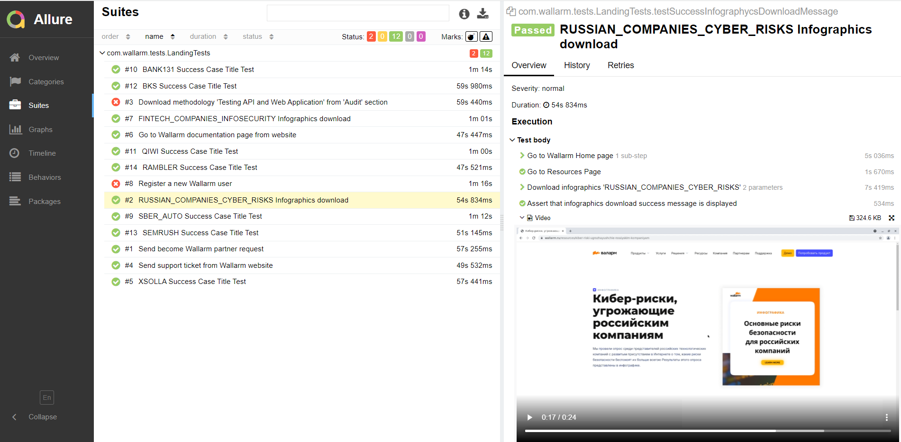
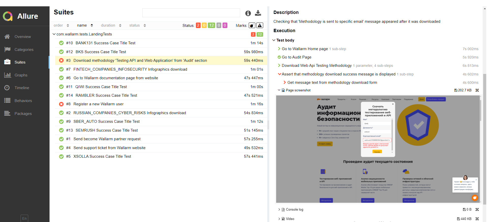

# 
   Autotests for [Miro: The Visual Collaboration Platform for Every Team](https://miro.com/) website

___
##  
 Technologies and tools used 

| IntelliJ IDEA | Gradle | Java | Junit5 | Selenide | Selenoid | Jenkins | Allure Report |
|:------:|:----:|:----:|:------:|:------:|:--------:|:--------:|:-------------:|
|  |  |  |  |  |  |  |  |

___
## The following test cases have been implemented:

1. Sign up a new Miro user and go to workspace via email confirmation link
2. **(Parameterized)** Display of a specific validation error when trying to sign up with incorrect field values
* Parameterized - a test is being executed multiple times using different set of entries 

___

## Example of test execution in [**Selenoid environment**](https://selenoid.autotests.cloud/#/)

___

## Running from [**Jenkins**](https://jenkins.autotests.cloud/job/MiroJob/build?delay=0sec)
To start the build you need to specify the following parameters:

* **THREAD_NUMBER** - Specifies the number of concurrent running threads. Leave empty for running with a single thread
* **CHROME_VERSION** - Chrome version for Selenoid environment
* **REMOTE_DRIVER_URL** - Host address for Selenoid

Allure report with test execution results will be generated automatically after build completion  

For more detailed information on a test, click on its name in the list. In the opened tab you can find a list of the test's execution steps and the video attachment of its whole run at the bottom. If the test marked as failed, a screenshot of its failure and browser console logs will also be attached.

