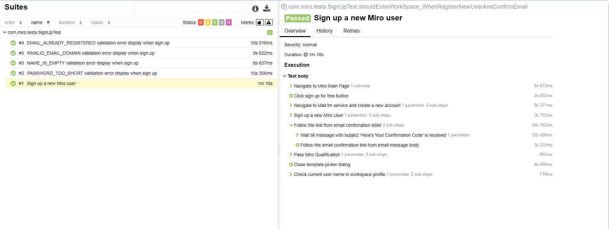
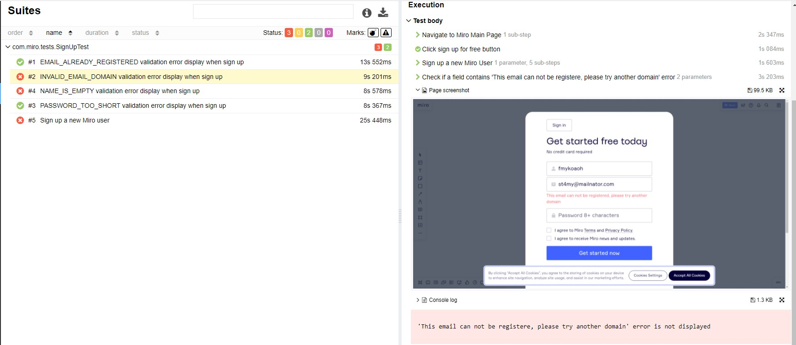

# 
   Autotests for [Miro: The Visual Collaboration Platform for Every Team](https://miro.com/)

___
##  
 Technologies and tools used 

| IntelliJ IDEA | Gradle | Java | Junit5 | Selenide | Selenoid | Allure Report |
|:------:|:----:|:----:|:------:|:------:|:--------:|:-------------:|
|  |  |  |  |  |  |  |  |

___
## The following test cases have been implemented:

1. Sign up a new Miro user and go to workspace via email confirmation link
2. **(Parameterized)** Display of a specific validation error when trying to sign up with incorrect field values
* Parameterized - a test is being executed multiple times using different set of entries 

___
## Test Build parameters
To start the build you can specify the following system.properties:

* **-Ddriver.remote** - **true** The build will be executed via remote chrome driver. **false (default value)** The build will be executed via local chrome driver.
* **-Dremote.url** - Host address for Selenoid environment. **Required if remote driver is chosen.**
* **-Dremote.browser** - Chrome version for Selenoid environment. **Required if remote driver is chosen.**
* **-Dremote.browser.version** - Chrome version for Selenoid environment. **Required if remote driver is chosen.**
* **-Dthreads** - Specifies the number of concurrent running threads. **The build will be executed in a single thread by default.**
## Example of command line arguments
on Selenoid environment:
* **./gradlew clean test --tests SignUpTest -Ddriver.remote=true -Dremote.chrome.version="91.0" -Dthreads="2" -Dremote.url="http://myhostexample:4444/wd/hub"** 

on Local environment:
* **./gradlew clean test --tests SignUpTest -Dthreads="2"** 

## 
 Allure report

Artifacts for allure report with test will be generated automatically after build completion. In order to generate allure report manually pass the following command in terminal:
* **./gradlew allureServe**

For more detailed information on a test, click on its name in the list. In the opened tab you can find a list of the test's execution steps. If the test marked as failed, a screenshot of its failure and browser console logs will be attached.

